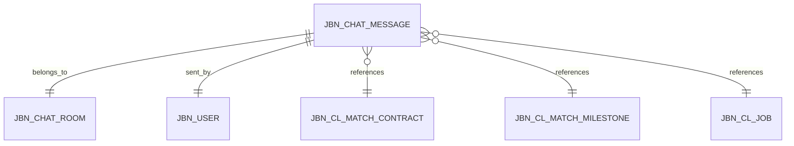

# JBN Chat Message API Specification

## Entity Overview

`JbnChatMessage` represents a message within a chat room. Messages can be of various types (TEXT, IMAGE, FILE, CONTRACT, MILESTONE, SYSTEM) and have different statuses (SENT, DELIVERED, READ, DELETED, EDITED).

## Entity Relationships



## API Endpoints

### Base Path
`/api/v1/jbn-chat-message`

### 1. Get Message by ID
- **Endpoint**: `GET /api/v1/jbn-chat-message/{id}`
- **Description**: Retrieve a specific chat message by its ID
- **Path Parameters**:
  - `id` (Long, required): The message ID
- **Response**: `JbnChatMessageResponse`
- **Status Codes**:
  - `200 OK`: Message found and returned
  - `404 Not Found`: Message not found

### 2. Create Message
- **Endpoint**: `POST /api/v1/jbn-chat-message/save`
- **Description**: Create a new chat message
- **Request Body**: `JbnChatMessageRequest`
- **Response**: `JbnChatMessageResponse`
- **Status Codes**:
  - `201 Created`: Message successfully created
  - `400 Bad Request`: Invalid request data
  - `409 Conflict`: Supabase message ID already exists

### 3. Update Message
- **Endpoint**: `PUT /api/v1/jbn-chat-message/update/{id}`
- **Description**: Update an existing chat message
- **Path Parameters**:
  - `id` (Long, required): The message ID to update
- **Request Body**: `JbnChatMessageRequest`
- **Response**: `JbnChatMessageResponse`
- **Status Codes**:
  - `200 OK`: Message successfully updated
  - `400 Bad Request`: Invalid request data
  - `404 Not Found`: Message not found

### 4. Update Message Status
- **Endpoint**: `PATCH /api/v1/jbn-chat-message/update-status/{id}`
- **Description**: Update only the status of a message (e.g., mark as READ, DELIVERED)
- **Path Parameters**:
  - `id` (Long, required): The message ID
- **Query Parameters**:
  - `status` (JBNChatMessageStatus, required): New status (SENT, DELIVERED, READ, DELETED, EDITED)
- **Response**: `JbnChatMessageResponse`
- **Status Codes**:
  - `200 OK`: Status successfully updated
  - `400 Bad Request`: Invalid status
  - `404 Not Found`: Message not found

### 5. Get Messages by Chat Room
- **Endpoint**: `GET /api/v1/jbn-chat-message/chat-room/{chatRoomId}`
- **Description**: Retrieve all messages for a specific chat room
- **Path Parameters**:
  - `chatRoomId` (Long, required): The chat room ID
- **Response**: `List<JbnChatMessageResponse>`
- **Status Codes**:
  - `200 OK`: Messages retrieved successfully

### 6. Get Messages by Sender
- **Endpoint**: `GET /api/v1/jbn-chat-message/sender/{senderUserId}`
- **Description**: Retrieve all messages sent by a specific user
- **Path Parameters**:
  - `senderUserId` (Long, required): The sender user ID
- **Response**: `List<JbnChatMessageResponse>`
- **Status Codes**:
  - `200 OK`: Messages retrieved successfully

### 7. Delete Message (Soft Delete)
- **Endpoint**: `DELETE /api/v1/jbn-chat-message/{id}`
- **Description**: Soft delete a message (sets isDeleted flag)
- **Path Parameters**:
  - `id` (Long, required): The message ID to delete
- **Response**: `204 No Content`
- **Status Codes**:
  - `204 No Content`: Message successfully deleted
  - `404 Not Found`: Message not found

### 8. Get Messages by Contract
- **Endpoint**: `GET /api/v1/jbn-chat-message/contract/{contractId}`
- **Description**: Retrieve all messages associated with a specific contract
- **Path Parameters**:
  - `contractId` (Long, required): The contract ID
- **Response**: `List<JbnChatMessageResponse>`
- **Status Codes**:
  - `200 OK`: Messages retrieved successfully

### 9. Get Messages by Milestone
- **Endpoint**: `GET /api/v1/jbn-chat-message/milestone/{milestoneId}`
- **Description**: Retrieve all messages associated with a specific milestone
- **Path Parameters**:
  - `milestoneId` (Long, required): The milestone ID
- **Response**: `List<JbnChatMessageResponse>`
- **Status Codes**:
  - `200 OK`: Messages retrieved successfully

### 10. Get Messages by Job
- **Endpoint**: `GET /api/v1/jbn-chat-message/job/{jobId}`
- **Description**: Retrieve all messages associated with a specific job
- **Path Parameters**:
  - `jobId` (Long, required): The job ID
- **Response**: `List<JbnChatMessageResponse>`
- **Status Codes**:
  - `200 OK`: Messages retrieved successfully

## Request/Response DTOs

### JbnChatMessageRequest
```java
{
    "supabaseMessageId": "string (required)",
    "chatRoomId": "Long (required)",
    "senderUserId": "Long (required)",
    "messageType": "JBNChatMessageType (required) - TEXT, IMAGE, FILE, CONTRACT, MILESTONE, SYSTEM",
    "messageStatus": "JBNChatMessageStatus (optional, default: SENT) - SENT, DELIVERED, READ, DELETED, EDITED",
    "messageTimestamp": "Instant (required)",
    "contractId": "Long (optional)",
    "milestoneId": "Long (optional)",
    "jobId": "Long (optional)",
    "messageMetadata": "String (optional, CLOB)"
}
```

### JbnChatMessageResponse
```java
{
    "messageId": "Long",
    "supabaseMessageId": "String",
    "chatRoom": "JbnChatRoomResponse",
    "sender": "JBNUserResponse (optional)",
    "messageType": "JBNChatMessageType",
    "messageStatus": "JBNChatMessageStatus",
    "messageTimestamp": "Instant",
    "contract": "JBNClMatchContractResponse (optional)",
    "milestone": "JBNClMatchMilestoneResponse (optional)",
    "job": "JBNClJobResponse (optional)",
    "isDeleted": "boolean",
    "isEdited": "boolean",
    "messageMetadata": "String",
    "createdAt": "Instant",
    "updatedAt": "Instant"
}
```

## Enums

### JBNChatMessageType
- `TEXT`: Plain text message
- `IMAGE`: Image message
- `FILE`: File attachment message
- `CONTRACT`: Contract-related message
- `MILESTONE`: Milestone-related message
- `SYSTEM`: System-generated message

### JBNChatMessageStatus
- `SENT`: Message has been sent
- `DELIVERED`: Message has been delivered to the recipient
- `READ`: Message has been read by the recipient
- `DELETED`: Message has been deleted
- `EDITED`: Message has been edited

## Business Rules

1. **Supabase Message ID**: Must be unique across all messages
2. **Soft Delete**: Messages are soft-deleted (isDeleted flag) rather than physically removed
3. **Status Progression**: Message status typically progresses: SENT → DELIVERED → READ
4. **Edit Tracking**: When a message is edited, `isEdited` flag is set to true
5. **Metadata**: `messageMetadata` can store additional information as JSON string for different message types (e.g., file URLs for FILE type, image URLs for IMAGE type)
6. **Relationships**: Messages can optionally reference contracts, milestones, or jobs for context
7. **Timestamp**: `messageTimestamp` should be set when the message is created and represents the actual time the message was sent

## Error Responses

### 400 Bad Request
```json
{
    "error": "Validation failed",
    "message": "Field validation errors",
    "details": {
        "field": "error message"
    }
}
```

### 404 Not Found
```json
{
    "error": "Not Found",
    "message": "Message with ID {id} not found"
}
```

### 409 Conflict
```json
{
    "error": "Conflict",
    "message": "Supabase message ID already exists"
}
```

### 500 Internal Server Error
```json
{
    "error": "Internal Server Error",
    "message": "An unexpected error occurred"
}
```

