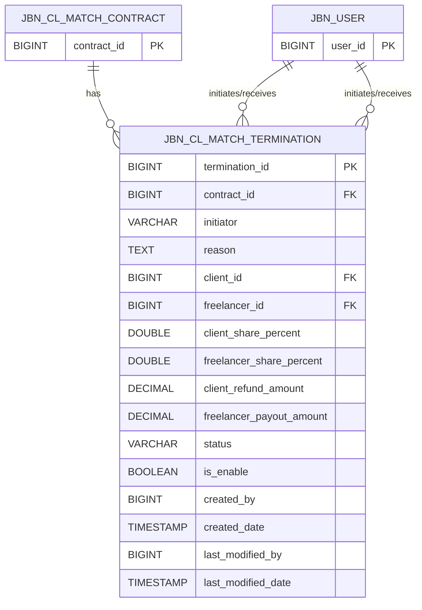

### ER Diagram (Mermaid)

---

### Relationship Explanation

* **JBN_CL_MATCH_CONTRACT → JBN_CL_MATCH_TERMINATION**

  * One contract can have **many terminations**
  * `contract_id` is a foreign key

* **CLIENT → JBN_CL_MATCH_TERMINATION**

  * A client can be involved in **many terminations**
  * Referenced by `client_id`

* **FREELANCER → JBN_CL_MATCH_TERMINATION**

  * A freelancer can be involved in **many terminations**
  * Referenced by `freelancer_id`
  
