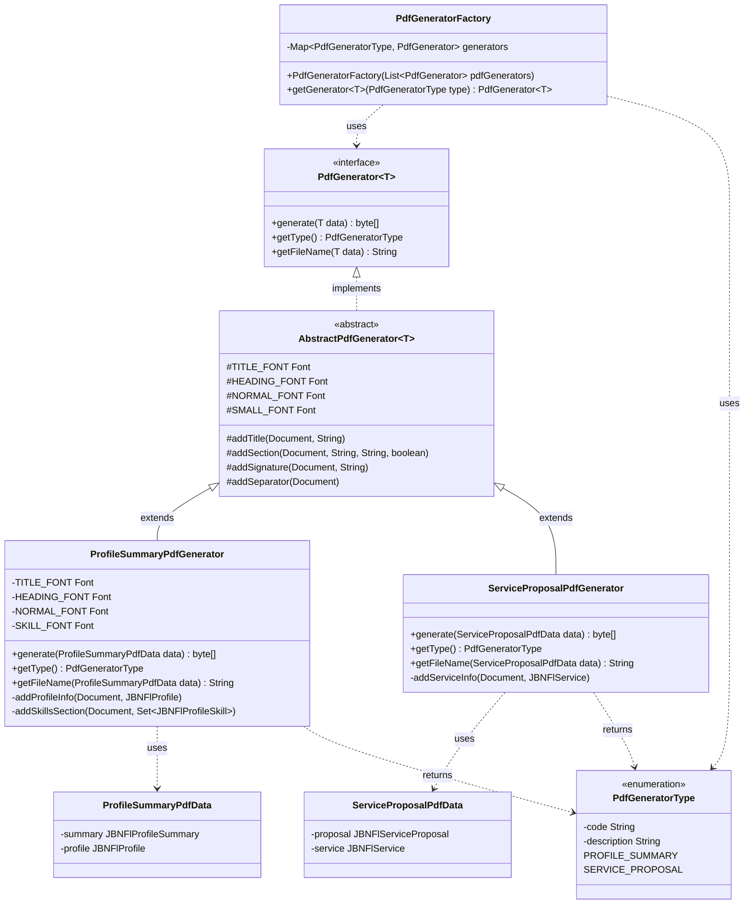

# PDF Generator Factory Pattern Implementation

## Overview

This document describes the PDF Generator Factory Pattern implementation used in the Jobonic application. The system automatically generates PDF documents for various entities (Profile Summary, Service Proposal, etc.) using a factory pattern that promotes extensibility, maintainability, and separation of concerns.

## Architecture

The implementation follows the **Factory Pattern** design, allowing the system to create PDF generators without specifying their concrete classes. This pattern provides:

- **Extensibility**: Easy to add new PDF generator types
- **Maintainability**: Clear separation between PDF generation logic and business logic
- **Type Safety**: Generic interface ensures type-safe PDF generation
- **Auto-Discovery**: Spring automatically discovers and registers all generators

## Class Diagram

### UML Diagram (Mermaid)




### ASCII Diagram

```
┌──────────────────────────────────────────────────────────────────────────┐
│                         PDF Generator Factory Pattern                    │
└──────────────────────────────────────────────────────────────────────────┘

┌──────────────────────────────────────────────────────────────────────────┐
│                          PdfGeneratorFactory                             │
│                          (Factory Class)                                 │
├──────────────────────────────────────────────────────────────────────────┤
│ - generators: Map<PdfGeneratorType, PdfGenerator<?>>                     │
├──────────────────────────────────────────────────────────────────────────┤
│ + PdfGeneratorFactory(List<PdfGenerator<?>> pdfGenerators)               │
│ + getGenerator<T>(PdfGeneratorType type): PdfGenerator<T>                │
└──────────────────────────────────────────────────────────────────────────┘
                              │
                              │ uses
                              ▼
┌──────────────────────────────────────────────────────────────────────────┐
│                    <<interface>> PdfGenerator<T>                         │
│                      (Abstract Product Interface)                        │
├──────────────────────────────────────────────────────────────────────────┤
│ + generate(T data): byte[]                                               │
│ + getType(): PdfGeneratorType                                            │
│ + getFileName(T data): String                                            │
└──────────────────────────────────────────────────────────────────────────┘
                              ▲
                              │ implements
                              │
┌──────────────────────────────────────────────────────────────────────────┐
│                    AbstractPdfGenerator<T>                               │
│                    (Abstract Base Class)                                 │
├──────────────────────────────────────────────────────────────────────────┤
│ # TITLE_FONT: Font (static)                                              │
│ # HEADING_FONT: Font (static)                                            │
│ # NORMAL_FONT: Font (static)                                             │
│ # SMALL_FONT: Font (static)                                              │
├──────────────────────────────────────────────────────────────────────────┤
│ # addTitle(Document, String)                                             │
│ # addSection(Document, String, String, boolean)                          │
│ # addSignature(Document, String)                                         │
│ # addSeparator(Document)                                                 │
└──────────────────────────────────────────────────────────────────────────┘
```

## Component Details

### 1. PdfGeneratorFactory (Factory)

The factory class that manages all PDF generator instances. It uses Spring's dependency injection to automatically discover and register all `PdfGenerator` implementations.

**Location**: `com.laconic.jobonic.utils.pdf.PdfGeneratorFactory`

**Key Methods**:
- `getGenerator<T>(PdfGeneratorType type)`: Returns the appropriate generator for the given type (throws `IllegalArgumentException` if not found)

### 2. PdfGenerator<T> (Interface)

The abstract interface that all PDF generators must implement.

**Location**: `com.laconic.jobonic.utils.pdf.PdfGenerator`

**Key Methods**:
- `generate(T data)`: Generates PDF bytes from the provided data (throws `Exception`)
- `getType()`: Returns the generator type
- `getFileName(T data)`: Returns the suggested file name for the PDF

### 3. AbstractPdfGenerator<T> (Abstract Base Class)

An abstract base class that provides common PDF generation functionality and shared fonts. Concrete generators can extend this class to reuse common methods and avoid code duplication.

**Location**: `com.laconic.jobonic.utils.pdf.impl.AbstractPdfGenerator`

**Protected Static Fonts**:
- `TITLE_FONT`: Bold, 20pt font for document titles
- `HEADING_FONT`: Bold, 14pt font for section headings
- `NORMAL_FONT`: Regular, 11pt font for body text
- `SMALL_FONT`: Regular, 10pt font for smaller text

**Protected Methods**:
- `addTitle(Document, String)`: Adds a centered title to the document
- `addSection(Document, String, String, boolean)`: Adds a section with optional heading and content
- `addSignature(Document, String)`: Adds a right-aligned signature
- `addSeparator(Document)`: Adds a horizontal separator line

**Note**: Both concrete generators extend this class, but `ProfileSummaryPdfGenerator` also defines its own font constants (including `SKILL_FONT`) for specific styling needs.

### 4. Concrete Generators

#### ProfileSummaryPdfGenerator

Generates PDF documents for freelancer profile summaries.

**Location**: `com.laconic.jobonic.utils.pdf.impl.ProfileSummaryPdfGenerator`

**Features**:
- Bold title (subject)
- Profile information (title, description, overview)
- Greeting and opening line
- "What I Offer" section
- "Why Work With Me" section
- Skills list with formatting
- Additional description
- Closing line and signature

**Data Input**: `ProfileSummaryPdfData` containing:
- `JBNFlProfileSummary` entity
- `JBNFlProfile` entity

#### ServiceProposalPdfGenerator

Generates PDF documents for service proposals.

**Location**: `com.laconic.jobonic.utils.pdf.impl.ServiceProposalPdfGenerator`

**Features**:
- Bold title (subject)
- Service information (title, description, rate)
- Greeting and opening line
- "Here's How I Can Help" section (main body)
- Additional details section
- Closing line and signature

**Data Input**: `ServiceProposalPdfData` containing:
- `JBNFlServiceProposal` entity
- `JBNFlService` entity

### 5. PdfGeneratorType (Enum)

Enumeration of all available PDF generator types. Each enum value contains a code and description.

**Location**: `com.laconic.jobonic.utils.pdf.PdfGeneratorType`

**Fields**:
- `code` (String): Unique identifier for the generator type
- `description` (String): Human-readable description

**Values**:
- `PROFILE_SUMMARY("profile-summary", "Profile Summary PDF Generator")`: For profile summary PDFs
- `SERVICE_PROPOSAL("service-proposal", "Service Proposal PDF Generator")`: For service proposal PDFs

## Usage Examples

### Example 1: Generating Profile Summary PDF

```java
@Service
public class JBNFlProfileSummaryService {
    private final PdfGeneratorFactory pdfGeneratorFactory;
    private final FileStorageHandler fileStorageHandler;
    
    private String generateAndSavePdf(JBNFlProfileSummary summary, JBNFlProfile profile) {
        // Get the PDF generator from factory
        PdfGenerator<ProfileSummaryPdfData> generator = 
            pdfGeneratorFactory.getGenerator(PdfGeneratorType.PROFILE_SUMMARY);
        
        // Prepare data for PDF generation
        ProfileSummaryPdfData pdfData = ProfileSummaryPdfData.builder()
                .summary(summary)
                .profile(profile)
                .build();
        
        // Generate PDF
        byte[] pdfBytes = generator.generate(pdfData);
        String fileName = generator.getFileName(pdfData);
        
        // Save and return URL
        MultipartFile pdfFile = MultipartFileUtil.createMultipartFile(
            pdfBytes, fileName, "application/pdf");
        FileMetadata metadata = fileStorageHandler.storeFile(pdfFile);
        
        return baseUrl + "/api/v1/image/file?image=" + metadata.storedFileName();
    }
}
```

### Example 2: Generating Service Proposal PDF

```java
@Service
public class JBNFlServiceProposalService {
    private final PdfGeneratorFactory pdfGeneratorFactory;
    private final FileStorageHandler fileStorageHandler;
    
    private String generateAndSavePdf(JBNFlServiceProposal proposal, JBNFlService service) {
        // Get the PDF generator from factory
        PdfGenerator<ServiceProposalPdfData> generator = 
            pdfGeneratorFactory.getGenerator(PdfGeneratorType.SERVICE_PROPOSAL);
        
        // Prepare data for PDF generation
        ServiceProposalPdfData pdfData = ServiceProposalPdfData.builder()
                .proposal(proposal)
                .service(service)
                .build();
        
        // Generate PDF
        byte[] pdfBytes = generator.generate(pdfData);
        String fileName = generator.getFileName(pdfData);
        
        // Save and return URL
        MultipartFile pdfFile = MultipartFileUtil.createMultipartFile(
            pdfBytes, fileName, "application/pdf");
        FileMetadata metadata = fileStorageHandler.storeFile(pdfFile);
        
        return baseUrl + "/api/v1/image/file?image=" + metadata.storedFileName();
    }
}
```

## API Endpoints

The following API endpoints automatically generate PDFs when saving or updating:

### Profile Summary
- **POST** `/api/v1/jbn-fl-profile-summary/save`
- **PUT** `/api/v1/jbn-fl-profile-summary/update/{id}`

**Response includes**: `pdfFileUrl` field with the URL to the generated PDF

### Service Proposal
- **POST** `/api/v1/jbn-fl-service-proposal/save`
- **PUT** `/api/v1/jbn-fl-service-proposal/update/{proposalId}`

**Response includes**: `pdfFileUrl` field with the URL to the generated PDF

## Extending the System

To add a new PDF generator type:

### Step 1: Add Enum Value

```java
// In PdfGeneratorType.java
public enum PdfGeneratorType {
    PROFILE_SUMMARY("profile-summary", "Profile Summary PDF Generator"),
    SERVICE_PROPOSAL("service-proposal", "Service Proposal PDF Generator"),
    NEW_TYPE("new-type", "New Type PDF Generator"); // Add new type
}
```

### Step 2: Create Data Class

```java
// Create NewTypePdfData.java
@Data
@Builder
public class NewTypePdfData {
    private YourEntity entity;
    // Add other required fields
}
```

### Step 3: Create Generator Implementation

You can either extend `AbstractPdfGenerator` (recommended) or implement `PdfGenerator` directly:

**Option A: Extend AbstractPdfGenerator (Recommended)**

```java
// Create NewTypePdfGenerator.java
@Component
public class NewTypePdfGenerator extends AbstractPdfGenerator<NewTypePdfData> {
    
    @Override
    public byte[] generate(NewTypePdfData data) throws Exception {
        if (data == null || data.getEntity() == null) {
            throw new IllegalArgumentException("Data cannot be null");
        }

        Document document = new Document(PageSize.A4);
        ByteArrayOutputStream baos = new ByteArrayOutputStream();
        PdfWriter.getInstance(document, baos);
        
        document.open();
        try {
            // Use inherited methods from AbstractPdfGenerator
            addTitle(document, "Your Title");
            addSection(document, "Section Heading", "Content here", true);
            addSignature(document, "Signature");
        } finally {
            document.close();
        }
        
        return baos.toByteArray();
    }
    
    @Override
    public PdfGeneratorType getType() {
        return PdfGeneratorType.NEW_TYPE;
    }
    
    @Override
    public String getFileName(NewTypePdfData data) {
        if (data == null || data.getEntity() == null || data.getEntity().getId() == null) {
            return "new-type.pdf";
        }
        return "new-type-" + data.getEntity().getId() + ".pdf";
    }
}
```

**Option B: Implement PdfGenerator Directly**

```java
// Create NewTypePdfGenerator.java
@Component
public class NewTypePdfGenerator implements PdfGenerator<NewTypePdfData> {
    
    @Override
    public byte[] generate(NewTypePdfData data) throws Exception {
        // Implement PDF generation logic
        Document document = new Document(PageSize.A4);
        ByteArrayOutputStream baos = new ByteArrayOutputStream();
        PdfWriter.getInstance(document, baos);
        
        document.open();
        try {
            // Add your PDF content here
        } finally {
            document.close();
        }
        
        return baos.toByteArray();
    }
    
    @Override
    public PdfGeneratorType getType() {
        return PdfGeneratorType.NEW_TYPE;
    }
    
    @Override
    public String getFileName(NewTypePdfData data) {
        return "new-type-" + data.getEntity().getId() + ".pdf";
    }
}
```

### Step 4: Use in Service

```java
@Service
public class YourService {
    private final PdfGeneratorFactory pdfGeneratorFactory;
    
    public void generatePdf(YourEntity entity) {
        PdfGenerator<NewTypePdfData> generator = 
            pdfGeneratorFactory.getGenerator(PdfGeneratorType.NEW_TYPE);
        
        NewTypePdfData pdfData = NewTypePdfData.builder()
            .entity(entity)
            .build();
        
        byte[] pdfBytes = generator.generate(pdfData);
        // Save PDF...
    }
}
```

**Note**: The generator will be automatically discovered by Spring and registered in the factory. No manual registration is needed!

## Dependencies

- **OpenPDF 3.0.0**: PDF generation library
- **Spring Framework**: Dependency injection and component scanning
- **Lombok**: Reduces boilerplate code

## File Structure

```
src/main/java/com/laconic/jobonic/utils/pdf/
├── PdfGenerator.java                    # Interface
├── PdfGeneratorType.java                 # Enum
├── PdfGeneratorFactory.java              # Factory class
├── ProfileSummaryPdfData.java           # Data class
├── ServiceProposalPdfData.java           # Data class
└── impl/
    ├── AbstractPdfGenerator.java         # Abstract base class
    ├── ProfileSummaryPdfGenerator.java   # Concrete generator
    └── ServiceProposalPdfGenerator.java  # Concrete generator
```

## Benefits

1. **Separation of Concerns**: PDF generation logic is isolated from business logic
2. **Easy Testing**: Each generator can be tested independently
3. **Type Safety**: Generic interface ensures compile-time type checking
4. **Extensibility**: Adding new generators doesn't require modifying existing code
5. **Auto-Discovery**: Spring automatically finds and registers all generators
6. **Consistent API**: All generators follow the same interface contract

## Design Patterns Used

- **Factory Pattern**: Centralized creation of PDF generators through `PdfGeneratorFactory`
- **Strategy Pattern**: Different PDF generation strategies for different types
- **Template Method Pattern**: `AbstractPdfGenerator` provides template methods for common PDF structure with customizable content
- **Inheritance**: Concrete generators extend `AbstractPdfGenerator` to reuse common functionality

## Future Enhancements

Potential improvements for the system:

1. **PDF Templates**: Support for custom PDF templates
2. **Styling Options**: Configurable fonts, colors, and layouts
3. **Multi-language Support**: Generate PDFs in different languages
4. **PDF Merging**: Combine multiple PDFs into one document
5. **Watermarking**: Add watermarks to generated PDFs
6. **Digital Signatures**: Support for PDF digital signatures

## Troubleshooting

### Generator Not Found

If you get an error "No PDF generator found for type: X", ensure:
1. The generator class is annotated with `@Component`
2. The generator implements `PdfGenerator<T>` interface
3. The `getType()` method returns the correct enum value
4. The package is scanned by Spring (check component scan configuration)

### PDF Generation Fails

Common issues:
1. **Null Data**: Ensure all required data fields are populated
2. **Font Issues**: Check if fonts are available in the system
3. **Memory Issues**: Large PDFs may require more heap space
4. **File Permissions**: Ensure write permissions for file storage

## License

This implementation is part of the Jobonic application.
