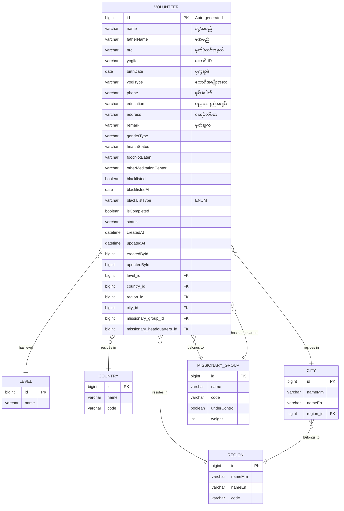

# Volunteer Entity ER Diagram

## Entity: Volunteer (တရားထောက်)

## Field Inheritance

The VOLUNTEER entity inherits fields from two parent classes:

1. **From MasterYogi** (inherited fields shown in VOLUNTEER):
   - `name`, `fatherName`, `address`, `remark`
   - `genderType`, `healthStatus`, `foodNotEaten`
   - `otherMeditationCenter`, `blacklisted`, `blacklistedAt`, `isCompleted`

2. **From MasterData** (inherited fields shown in VOLUNTEER):
   - `id`, `status`, `createdAt`, `updatedAt`
   - `createdById`, `updatedById`
